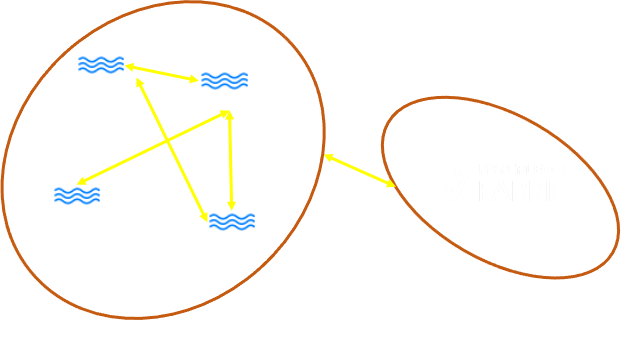
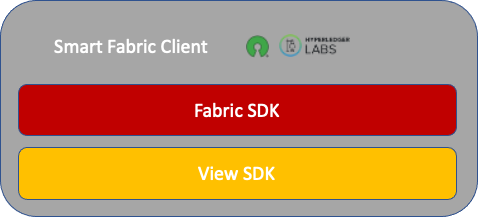
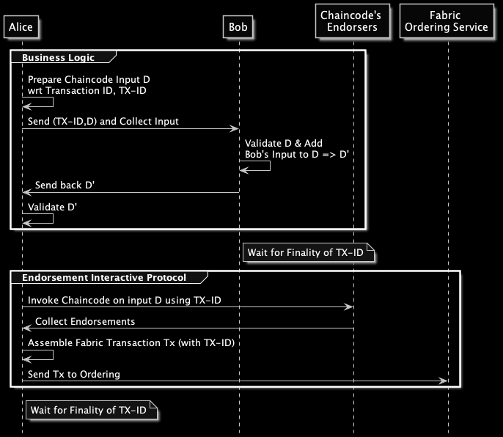
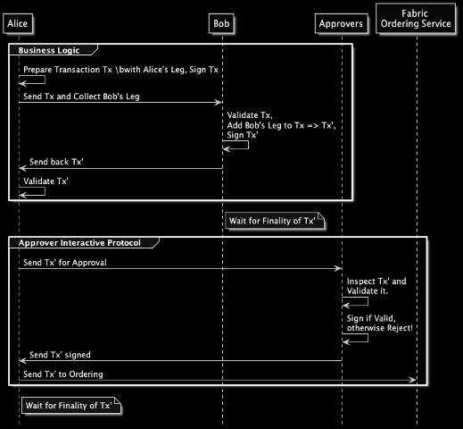

# Teh Fabric Smart Client

The `Fabric Smart Client` (FSC, for short) is the `Next-Generation Fabric Client SDK`. FSC simplifies the development 
of Fabric-based distributed applications by putting at the centre the `business processes`, and by 
`hiding the unnecessary burden` of dealing with Fabric.

A `business process` is a collection of `related and structured activities` carried by `business parties` 
in which a specific sequence of steps serves a particular `business goal`. In other words, a business process 
is an `interactive protocol` among `business parties` each of which has its own `business view` (or simply `view`) 
of the process. A `view` is then the sequence of steps that a business party must execute to serve a particular `business goal`.
FSC aims to offer a comfortable environment to build such interactive protocols backed by the Hyperledger Fabric blockchain.

## Fabric and its Hidden Gems

A Fabric network consists of a set of network nodes. As Fabric is permissioned, all network nodes have an identity. 
These nodes take up one of three roles:
- `Clients` submit `transaction proposals` for execution (or simulation), help orchestrate the execution phase, and, 
  finally, broadcast transactions for ordering.
- `Peers` execute transaction proposals and validate transactions. All peers maintain the blockchain ledger, an 
  append-only data structure recording all transactions in the form of a hash chain, as well as the state, a 
  succinct representation of the latest ledger state. Not all peers execute all transaction proposals, only a 
  subset of them called endorsing peers (or, simply, endorsers) does, as specified by the policy of the chaincode 
  to which the transaction pertains.
- `Ordering Service Nodes (OSN)` are the nodes that collectively form the ordering service. In short, the ordering 
  service establishes the total order of all transactions in Fabric, where each transaction contains state updates 
  and dependencies computed during the execution phase, along with cryptographic signatures of the endorsing peers.

Fabric Nodes interact to achieve pre-defined goals. Let's give a quick look at the transaction lifecycle, and the 
interactive protocols used by Fabric nodes. It can be split in three phases:

- `Execution Phase`: In the execution phase, clients sign and send a transaction proposal (or, simply, proposal) 
  to one or more endorsers for execution. The endorsers simulate the proposal, by executing the operation of the 
  specified chaincode, which has been installed on the blockchain. After the simulation, the endorser cryptographically 
  signs a message called endorsement, which contains readset and writeset (RWSet, for short) (together with metadata 
  such as transaction ID, endorser ID, and endorser signature) and sends it back to the client in a proposal response. 
  The client collects endorsements until they satisfy the endorsement policy of the chaincode, which the transaction invokes.
- `Ordering Phase`: When a client has collected enough endorsements on a proposal, it assembles a transaction and 
  submits this to the ordering service.
- `Validation Phase`: Blocks are delivered to peers either directly by the ordering service or through gossip. 
  A new block then enters the validation phase which consists of three sequential steps: 
  - (i) The evaluation of the endorsement policy occurs in parallel for all transactions within the block,
  - (ii) A read-write conflict check is done for all transactions in the block sequentially, 
  - (iii) The ledger update phase runs last, in which the block is appended to the locally stored ledger, and the blockchain state is updated.

Notice that, each phase is essentially an interactive protocol, executed by given parties, used to achieve a specific goal.
A few remarks on the above protocol will help the reader to understand the reasons why we decided to revise it, 
and the directions we want to follow:
- `Each party should be able to run its own business logic`: The *endorsement policy* does not say anything 
  about the process that should be used to assemble the RWSet. 
  In particular: 
  - It does not say that all endorsers of a given chaincode should run the same business logic. 
  - Nor it says that the RWSet should be produced by Fabric Endorsers. 
    
  Indeed, the execution phase can be implemented in other ways. For example, the clients could assemble the RWSet 
  directly and then ask the endorsers to `approve` the transaction.
- `Free players`: Fabric nodes have a precise role in the network. In other words, Fabric nodes are not interchangeable. 
  This means that a client cannot endorse the transaction, an endorser cannot submit transactions to the ordering service, 
  and so on. Indeed, an endorser is just a network node that possesses a signing secret key accepted by some endorsement policy.
  Therefore, a Fabric Smart Client node equipped with the proper key material can play the role of endorser.

The above remarks guided us during the design of the Fabric Smart Client.

## Design Key Ingredients

FSC is founded on the following key ingredients to build interactive protocols:
- `View`: A distributed application consists of multiple interactive protocols. An interactive protocol represents 
  a computation jointly carried on by multiple parties in a distributed fashion. Those parties communicate by 
  establishing communication channels or sessions. The view of each party in an interactive protocol is what we call 
  `View`. We call `initiator` the party that starts the interactive protocol. The initiator does that by executing the 
  view representing her in that interactive protocol. When a view opens a communication session to another party, 
  this party executes, in response, the view representing her role in the interaction.
  Therefore, views are unit of computation that can be used to agree on the content of a transaction, to disseminate data, 
  to perform key agreement, to deliver a transaction to an ordering service, and so on.
- `Identity`: Each party has at least one `identity`. To keep this concept as general as possible, 
  we defined an identity as a container of a lower level identity. A lower level identity can be anything meaningful 
  enough to represent the intuitive concept of a digital identity. For example, it can be an X509 certificate, 
  an ECDSA public-key, an Idemix identity, and so on. An identity can be used to produce digital signatures, 
  to identify the party that a view want to open a communication session to, and so on.
- `Session`: One of the main goals of the Fabric Smart Client is to help developers designing distributed applications. 
  The core of any distributed application is its communication layer. Therefore, FSC provides a communication 
  abstraction that we call `Session`. A session is a bidirectional communication channel, with a unique identifier, 
  between two parties identified by their identities. Let us now describe the lifecycle of a session with an example. 
  Alice and Bob are two parties who know each other and who wants to interact to accomplish a given task. 
  Alice is the initiator and starts the interactive protocol by executing the view representing her in the protocol.
  At some point, Alice needs to send a message to Bob. To do that, Alice opens a session to Bob. Notice that, we are 
  assuming that Alice knows already Bob’s identity. When Alice’s message reaches Bob, Bob responds by executing the 
  view representing him in protocol. Bob gets Alice’s message by first obtaining the session Alice’s opened. 
  Bob can use the very same session to respond to Alice and the ping-pong can continue until Alice and Bob reach their goal.

## FSC is the Perfect Companion for Fabric

We call `FSC Node` a network node that runs the FSC stack. FSC nodes form an `FSC network`. 
This network lives alongside one or more Fabric networks. 
FSC nodes can connect to each other in a peer-to-peer fashion. 
Moreover, each FSC node connects to one or more `trusted` Fabric peers to learn about the status of the Fabric network 
(transactions committed, events, discovery, and so on...). 
Here is a pictorial representation of these networks.

Then, a network node running FSC is a `Business Party` at the Application/Business Layer.
Business Parties run Views to orchestrate a Business Process and achieve a Business Goal
Each FSC node exposes a GRPC service that allows the owner/administrator of the node to `initiate` business processes.
A business process is started by an `initiator view`.

## The Fabric Smart Client Stack

The Fabric Smart Client consists of `platforms` or `SDKs`. Each platform exposes a coherent set of API to address specific tasks
FSC comes equipped with two default SDKs :

- The `View` SDK is the core of the FSC. It offers API and services to allow FSC nodes:
    - To connect to each other in a peer to peer fashion.
    - To manage and execute business views.
    - To handle node identities.
- The `Fabric` SDK builds on top of the `View` platform and offers API and services to allow FSC nodes to communicate 
  with Fabric. The Fabric module is not just the usual Fabric Client SDK, it is more. 
  Indeed, we can identify the following components that make the Fabric module different from the current Fabric Client SDKs:
  - `Chaincode API`: These are APIs that allow the developer to invoke any chaincode and assemble Fabric transactions 
    as she would do with the Fabric Client SDK.
  - `Identity Management`: The Fabric platform allows an FSC node to play the role of an `Endorser`, 
    not just that of a `Fabric Client`.
  - `State-Based Programming Model API` (`SPM`, for short): Instead of dealing directly with a Read-Write Set (RWS, for short), 
    the SPM API allows the developer to think directly in terms of business objects. The SPM API takes care of translating 
    these business objects to a well-formed RWS. Therefore, FSC nodes can collaboratively assemble a Fabric Transaction and its RWS, 
    and then other FSC nodes, playing the role of endorsers, endorse the assembled transaction. 
    This gives much more flexibility than the default chaincode-centric protocol to assemble transactions, that Fabric offers.
  - `Vault`: The Fabric platform equips an FSC node with a local storage system that contains only the transactions 
    the node is interested about or helped to assemble. An FSC node does not need to store the entire ledger but 
    only what is relevant. This storage space allows the FSC nodes to keep temporary version of the transactions 
    they are assembling before they get submitted for ordering.
  
### The View SDK 

This is the `View SDK` stack:

It consists of the following layers:
- `Services` (light-blue boxes): Services offer pre-packaged functionalities,
  like `Token Transaction` assembling, Token Selectors, and so on.
  They are built of top of the `Token API` abstraction. Therefore, they are independent of the underlying token technology.
- `View API`: This API offers a useful abstraction to deal with tokens in an implementation-independent way.
- `Driver API`: This API takes the burden of translating calls of the Token API into API calls that are implementation-specific.
- `Driver Implementations`: This is the lowest level of the Token SDK. A driver implementation is responsible for
  defining the representation of tokens on the ledger, what it means to perform certain token actions,
  and when a token transaction is valid, among other things.
  
### The Fabric SDK

This is the `Fabric SDK` stack:

It consists of the following layers:
- `Services` (light-blue boxes): Services offer pre-packaged functionalities,
  like `Token Transaction` assembling, Token Selectors, and so on.
  They are built of top of the `Token API` abstraction. Therefore, they are independent of the underlying token technology.
- `View API`: This API offers a useful abstraction to deal with tokens in an implementation-independent way.
- `Driver API`: This API takes the burden of translating calls of the Token API into API calls that are implementation-specific.
- `Driver Implementations`: This is the lowest level of the Token SDK. A driver implementation is responsible for
  defining the representation of tokens on the ledger, what it means to perform certain token actions,
  and when a token transaction is valid, among other things.

## Transaction Lifecycle or How to orchestrate a business process

There are two ways to orchestrate transactions using the Fabric Smart Client:

- The first possibility is to have the business parties agreeing on an input on which to invoke a certain function
of a given chaincode. Once the parties agree on the input, one of them can start the endorsement process
  while the other wait for the confirmation that Fabric committed the transaction.
- The other possibility is to have the business parties assemble directly a Fabric transaction.
This means preparing the RW set, and collecting endorsements. Moreover, the endorsements can be produced 
  directly by other Fabric Smart Client nodes, that we call `Approvers`, equipped with
  signing keys compatible with the endorsement policy of the chaincode the transaction targets. 

Let us explore the above two possibilities in the following Sections.

### A Chaincode Mediated Example

In this example, Alice and Bob are Business Parties each of which has a network node running the FSC stack.
Each FSC node has also a (client) Fabric identity to communicate with Fabric.
We assume that there is a Fabric network with a chaincode deployed already.

The business process, Alice and Bob execute, consists of agreeing on the input on which to invoke the chaincode,
and then submit a Fabric transaction.

Here is the pictorial representation of the business process Alice and Bob execute.

Step by step:
- Alice initiates the business process by preparing a draft of the input `D` with her leg.
- Alice asks Bob to inspect `D`, and to add his leg to form `D’`.
- Bob sends back `D'` and Alice can further inspect Bob's leg for additional validations.
  (signatures can be put in place to make sure Alice cannot change what Bob has put).
- Finally, Alice starts the endorsement process and then submit the resulting Fabric transaction to the Fabric Ordering 
  Service.
- Both parties wait for Fabric to confirm the transaction.

### An Approvers Mediated Example

In this example, we still have Alice and Bob, with their FSC nodes, but we also have the `Approvers`.
An `approver` is a network node running the FSC nodes that is equipped with a Fabric identity 
that can be used to endorse the chaincode Alice and Bob use to track their data. 
Notice that, an approver is not a Fabric peer.

The difference with the previous case is that Alice and Bob now agree directly on the content of the transaction.
Indeed, Alice and Bob assemble a full-fledged Fabric transaction with its own RW set.
At the end of this process, Alice sends the transaction to the approvers.
Each approver can run its own business logic to inspect the transaction and then decide if to endorse it. 

Here is the pictorial representation of the business process Alice and Bob execute.

Step by step:
- Alice initiates the business process by preparing a transaction `Tx` with her leg.
- Alice asks Bob to inspect `Tx`, and to add his leg to form `Tx’`, and to sign it.
- Bob sends back `Tx'` and Alice can further inspect Bob's leg for additional validations.
- Alice sends `Tx’` to the Approvers to be approved (or endorsed).
- If `Tx’` gets approved, Alice sends it directly to the Fabric Ordering Service.
- Both parties wait for Fabric to confirm the transaction.

Notice that without the Approvers’ signatures, Fabric rejects the transaction. Indeed, the Approvers are Business Parties that play the role of `Fabric Endorsers`.
