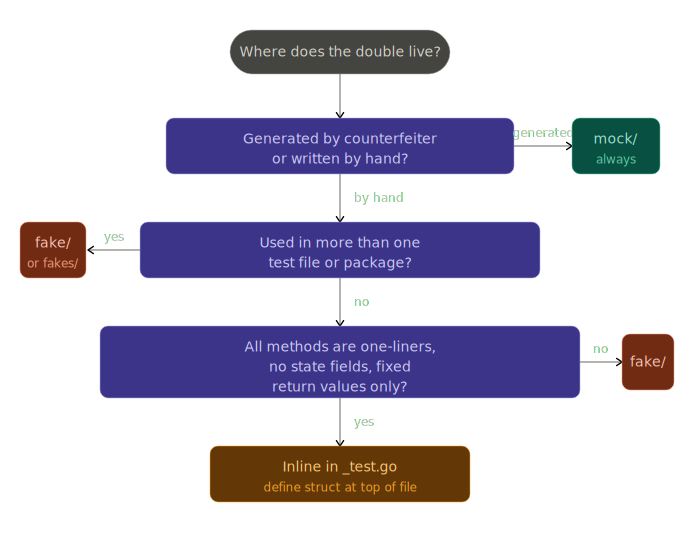

# Mocks and Fakes

This document explains how test doubles are defined, generated, and maintained in FSC, and when to use each kind.

## Two kinds of test doubles

FSC uses two complementary patterns:

| Pattern  | Directory           | How created                  | When to use                                                              |
|----------|---------------------|------------------------------|--------------------------------------------------------------------------|
| **Mock** | `mock/`             | Generated by `counterfeiter` | Need to assert call counts, arguments, or return values per call         |
| **Fake** | `fake/` or `fakes/` | Written by hand              | Need a simple, predictable implementation without call-tracking overhead |

The choice is driven by what the test needs to verify, not by convention. If the test only needs the dependency to return a value, a fake is simpler. If the test needs to assert _how_ the dependency was called, use a mock.

## Mocks — counterfeiter-generated

### Declaring a mock

Place `//go:generate` directives in the source file closest to where the interface is consumed — either the production `.go` file or the `_test.go` file for that package:

```go
//go:generate counterfeiter -o mock/signer.go --fake-name Signer github.com/hyperledger-labs/fabric-smart-client/platform/fabric/driver.Signer
```

Generated files always land in a sibling `mock/` directory and carry a `package mock` declaration. The `--fake-name` flag sets the struct name inside the generated file.

To mock a local (same-package) interface, use `.` as the package path:

```go
//go:generate counterfeiter -o mock/query_service.go --fake-name QueryService . QueryService
```

### Generating mocks

Regenerate all mocks from scratch:
```bash
make generate-mocks
```

This target runs `scripts/find-mocks.sh --delete` (removes every `package mock` directory) and then `go generate ./...` to recreate them all.

To regenerate only the mocks for one package, run `go generate` scoped to that directory:

```bash
go generate ./platform/fabricx/core/transaction/...
```

### Invariant: mock directories must be pure counterfeiter output

Every `.go` file under a `package mock` directory must have been generated by counterfeiter. `scripts/find-mocks.sh` enforces this:

```bash
./scripts/find-mocks.sh          # check — exits non-zero on violation
./scripts/find-mocks.sh --delete # delete all valid (fully-generated) mock dirs
```

Never add handwritten code to a `mock/` directory. If you need a helper alongside generated mocks, put it in a `fake/` directory instead.

### Using a mock in a test

Counterfeiter-generated mocks expose stubs and call-recording fields for every method:

```go
signer := &mock.Signer{}
signer.SignReturns([]byte("sig"), nil)

// ... call production code that uses signer ...

Expect(signer.SignCallCount()).To(Equal(1))
_, payload := signer.SignArgsForCall(0)
Expect(payload).To(Equal(expectedPayload))
```

## Fakes — handwritten test doubles

Fakes live in `fake/` (or `fakes/`) directories and are written by hand. There are two styles in the codebase.

### Simple struct fake

Use this when the test just needs the dependency to return a known value:

```go
// platform/common/core/generic/vault/fake/qe.go
type QE struct {
    State    driver.VaultValue
    Metadata map[string][]byte
}

func (qe QE) GetState(_ context.Context, _ driver.Namespace, pkey driver.PKey) (*driver.VaultRead, error) {
    return &driver.VaultRead{Key: pkey, Raw: qe.State.Raw, Version: qe.State.Version}, nil
}
```

### testify/mock-backed fake

Use this when you need conditional behavior or call assertions but prefer to write the implementation by hand (e.g., because the interface is large and you only care about a few methods):

```go
// platform/fabric/core/generic/finality/fake/fakes.go
type Committer struct {
    mock.Mock
}

func (m *Committer) AddFinalityListener(txID string, listener fdriver.FinalityListener) error {
    args := m.Called(txID, listener)
    return args.Error(0)
}

// No-op methods that the test doesn't care about
func (m *Committer) Start(ctx context.Context) error { return nil }
```

Set up expectations the testify way:

```go
committer := &fake.Committer{}
committer.On("AddFinalityListener", txID, mock.Anything).Return(nil)
```

### Integration test fakes

The `integration/` tree uses fakes to stand in for real view implementations (factories, runners, initiators, responders). These are ordinary Go structs that satisfy the relevant interfaces — no generation needed.

## Placement guide — where does the double live?

The right location for a test double depends on how it was created and how widely it is used.

**`mock/` directory** — counterfeiter-generated doubles only, always. No handwritten code ever belongs here.

**`fake/` (or `fakes/`) directory** — handwritten doubles that are shared across more than one test file or package, or that are too complex to sit inline: conditional logic in any method body, state fields that drive behavior, or more than ~5 methods.

**Inline in `_test.go`** — handwritten doubles used only in a single test file, where all of the following hold:
- All methods are one-liners
- Every method returns a fixed value — no conditionals, no loops
- No state fields (the struct carries no behavioral state)
- The full definition fits in ~15 lines without crowding the test

If any one of those conditions fails, move it to `fake/`.

### Decision tree



### Inline example

A double this simple belongs at the top of the `_test.go` file:

```go
type stubReader struct{ data []byte }

func (r stubReader) Read(_ context.Context, _ string) ([]byte, error) {
    return r.data, nil
}
```

Once it grows a conditional or gets imported by a second test file, move it to `fake/`.

## Quick-reference checklist

- [ ] Need to assert call count or captured arguments → use a counterfeiter **mock**
- [ ] Need a simple canned return value → use a handwritten **fake** struct
- [ ] Need conditional behavior without full codegen → use a **testify/mock-backed fake**
- [ ] Adding a new interface to a package that already has mocks → add a `//go:generate` line and run `make generate-mocks`
- [ ] Introducing a helper in a `mock/` directory → move it to `fake/` instead
- [ ] After changing an interface → run `make generate-mocks` to keep generated code in sync