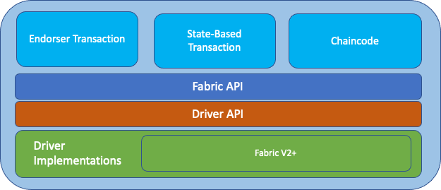

# The Fabric SDK

This is the `Fabric SDK` stack:



It consists of the following layers:
- `Services` (light-blue boxes): Services offer access to Fabric-specific functionality, such as transaction endorsement, state-based endorsement, and the execution of Chaincode.
- `Fabric API`: This API follows the same abstraction paradigm as the `View API` but provides Fabric-specific functionality to enable `FSC nodes` to communicate with Fabric. Even though this API is specific for Fabric, it allows to abstract away certain details when dealing with a specific Fabric version.
- `Driver API`: This API translates the `Fabric API` to a concrete driver implementation.
- `Driver Implementations`: The Fabric SDK comes with a driver implementation for Fabric V2+.

## Configuration

Here is an annotated example of the configuration of the Fabric SDK:

```yaml
# The fabric section defines the configuration of the fabric networks.  
fabric:
  # Is the fabric-sdk enabled
  enabled: true
  # The name of the network
  default:
    # Is this the default network?
    default: true
    # The MSP config path of the default identity to connect to this network.
    mspConfigPath: /crypto/peerOrganizations/org1.example.com/peers/approver.org1.example.com/msp
    # Local MSP ID of the default identity
    localMspId: Org1MSP
    # Cache size to use when handling idemix pseudonyms. If the value is larger than 0, the cache is enabled and
    # pseudonyms are generated in batches of the given size to be ready to be used.
    mspCacheSize: 500
    msps:
      - id: idemix # The id of the identity. 
        mspType: idemix # The type of the MSP.
        mspID: IdemixOrgMSP # The MSP ID.
        # The path to the MSP folder containing the cryptographic materials.
        path: crypto/peerOrganizations/org2.example.com/peers/alice.org2.example.com/extraids/idemix
    tls:
      enabled:  true
      clientAuthRequired: false
      cert:
        file: /crypto/peerOrganizations/org1.example.com/peers/approver.org1.example.com/tls/server.crt
      key:
        file: /crypto/peerOrganizations/org1.example.com/peers/approver.org1.example.com/tls/server.key
      clientCert:
        file: /crypto/peerOrganizations/org1.example.com/peers/approver.org1.example.com/tls/server.crt
      clientKey:
        file: /crypto/peerOrganizations/org1.example.com/peers/approver.org1.example.com/tls/server.key
      rootcert:
        file: /crypto/peerOrganizations/org1.example.com/peers/approver.org1.example.com/tls/ca.crt
      clientRootCAs:
        files:
          - /crypto/peerOrganizations/org1.example.com/peers/approver.org1.example.com/tls/ca.crt
      rootCertFile: /crypto/ca-certs.pem
      keepalive:
        client:
          interval: 60s
          timeout: 600s
        server:
          interval: 60s
          timeout: 600s
          minInterval: 60s
    # This section is dedicated to interactions with the ordering service
    ordering:
      # numRetries specifies the number of retries to have when failing reaching the ordering service
      numRetries: 3
      # retryInternal specifies the amount of time to wait before retrying a connection to the ordering service
      retryInternal: 3s
    # List of trusted peers this node can connect to. There must be at least one trusted peer.
    peers:
      - address: 127.0.0.1:20013
        connectionTimeout: 10s
        tlsEnabled: true
        tlsRootCertFile: /crypto/ca-certs.pem
        serverNameOverride:
    # List of channels this node is aware of
    channels:
      - name: testchannel
        default: true
        chaincodes:
          - name: iou
            private: false
    # Configuration of the vault used to store the RW sets assembled by this node
    vault:
      persistence:
        type: file
        opts:
          path: /approver/fabric.default/vault
      txidstore:
        cache:
          # Sets the maximum number of cached items 
          cache: 200
    # The endpoint section tells how to reach other Fabric nodes in the network.
    # For each node, the name, the domain, the identity of the node, and its addresses must be specified.
    endpoint:
      resolvers:
        - name: approver
          domain: org1.example.com
          identity:
            id: approver
            mspType: bccsp
            mspID: Org1MSP
            path: /crypto/peerOrganizations/org1.example.com/peers/approver.org1.example.com/msp/signcerts/approver.org1.example.com-cert.pem
          addresses:
          aliases:
```

