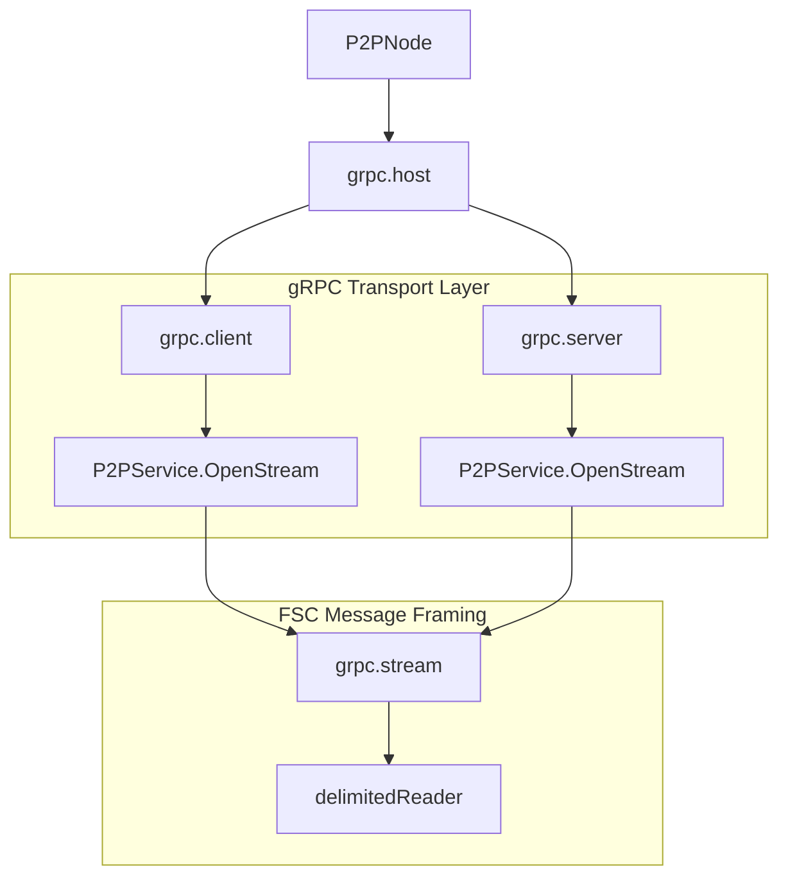

# gRPC Transport

The gRPC transport provides a bidirectional streaming communication channel for
FSC node-to-node traffic. It is intended for deployments that already use gRPC
and HTTP/2 for server-to-server communication and want FSC P2P traffic to
follow the same operational model.

## Overview

This transport keeps the current FSC Comm/session architecture intact. It adds
gRPC as another `P2PHost` backend under the Comm layer rather than introducing
a separate messaging stack.

### Key Characteristics
- **Bidirectional Streaming**: Each transport stream is a gRPC bidirectional
  stream carrying FSC message frames.
- **Mutual TLS**: mTLS is mandatory and enforced for both client and server
  authentication.
- **Identity Binding**: The claimed peer identity in the stream-open metadata
  is validated against the identity derived from the verified TLS certificate.
- **Session Compatibility**: Existing `P2PNode`, `MasterSession`, responder
  dispatch, and logical session handling are preserved.
- **Clear Role Separation**: This transport is for FSC node-to-node P2P
  traffic. It does not replace the external View gRPC API configured under
  `fsc.grpc.*`.

## Internal Architecture

The gRPC transport implementation is built around a dedicated host package under
`platform/view/services/comm/host/grpc`.

### Component Diagram



### Transport Handshake

1. **TLS Connect**: The client establishes a TLS connection to the remote
   node's P2P endpoint.
2. **mTLS Verification**: Both parties exchange certificates and verify them
   using the configured root CAs plus the trusted identities known through the
   endpoint service.
3. **gRPC Stream Open**: The client opens the `P2PService.OpenStream`
   bidirectional RPC.
4. **Stream-Open Metadata**: The client sends an initial `StreamOpen` message
   containing:
   - claimed `PeerID`
   - `ContextID`
   - `SessionID`
   - propagated tracing context
5. **Identity Binding Validation**: The server derives the remote peer identity
   from the verified TLS certificate and compares it to the claimed `PeerID`.
   If they differ, the transport rejects the stream before handing it to the
   Comm layer.
6. **Comm Integration**: Once accepted, the stream is wrapped as a
   `host.P2PStream` and consumed by the existing FSC Comm/session logic.

## Message Framing and Session Semantics

The gRPC transport does not redefine FSC message semantics. It carries the same
FSC `ViewPacket` protobuf frames used by the other transports.

- **Transport Frame**: The gRPC stream carries `StreamPacket` messages.
- **Open Frame**: The first packet contains `StreamOpen` metadata.
- **Payload Frames**: Subsequent packets contain opaque FSC message bytes.
- **Delimited Reader**: The transport uses a delimited reader to preserve the
  current FSC framing expectations over the streaming RPC.

In the current implementation, the stream hash includes:
- remote peer ID
- remote peer address
- session ID
- context ID

That means the gRPC transport does not currently recycle a single physical
stream across unrelated logical FSC sessions the way the WebSocket multiplexer
does. Logical session semantics still remain unchanged at the FSC level.

## Security and Identity

The main security invariant is the same one enforced by the hardened WebSocket
transport:

- the remote node must present a valid TLS certificate
- the certificate must chain to a trusted root or trusted endpoint identity
- the claimed FSC peer identity must match the identity derived from the
  verified certificate

This prevents a peer from opening a valid TLS session and then impersonating a
different FSC node in application metadata.

### Trust Sources

The gRPC transport builds trust from two places:

1. **Static trust roots**
   - `fsc.p2p.opts.grpc.tls.serverRootCAs.files`
   - `fsc.p2p.opts.grpc.tls.clientRootCAs.files`
2. **Endpoint service trust material**
   - identities already known to the local endpoint service are added as extra
     trust material when the transport host is created

The transport credential pair is selected in this order:

1. `fsc.p2p.opts.grpc.tls.key.file` and `fsc.p2p.opts.grpc.tls.cert.file`
2. `fsc.identity.key.file` and `fsc.identity.cert.file`

That means a deployment can either:
- reuse the node's main FSC identity for grpc p2p transport security, or
- provide a dedicated transport certificate and key for grpc p2p

The transport does not use `fsc.grpc.tls.*`, because that configuration
belongs to the external View gRPC API rather than the node-to-node P2P
transport.

When a dedicated grpc transport certificate is used, endpoint identity
resolution for grpc p2p must resolve to that same certificate so the claimed
peer ID and the verified transport identity stay aligned.

## Trust and Access Control

A remote node can only establish a gRPC P2P stream if all of the following are
true:

- it presents a certificate accepted by the local trust configuration
- it can complete mTLS successfully
- its claimed peer identity matches the identity derived from its certificate

If any of those checks fail, the stream is rejected before it reaches the FSC
session layer.

## Configuration

The gRPC transport is configured under `fsc.p2p`. It is separate from the
external View gRPC API configured under `fsc.grpc`.

```yaml
fsc:
  p2p:
    # Transport type must be "grpc"
    type: grpc
    # P2P listen address. FSC currently reuses the standard P2P listenAddress
    # field and converts the libp2p-style multiaddress into host:port form for
    # the grpc listener.
    listenAddress: /ip4/0.0.0.0/tcp/11511

    opts:
      # ------------------- grpc specific options -------------------------
      grpc:
        # Connection timeout for outbound peer dials
        connectionTimeout: 10s
        tls:
          # grpc p2p requires mutual TLS, so this must remain true.
          # If omitted, FSC defaults it to true.
          clientAuthRequired: true
          # Optional dedicated key and certificate for grpc p2p transport.
          # If omitted, FSC falls back to fsc.identity.key.file and
          # fsc.identity.cert.file.
          key:
            file: /path/to/transport/key.pem
          cert:
            file: /path/to/transport/cert.pem
          # Root certificates used by this node as a grpc client
          serverRootCAs:
            files:
              - /path/to/server/tls/ca.crt
          # Root certificates used by this node as a grpc server
          clientRootCAs:
            files:
              - /path/to/client/tls/ca.crt
  identity:
    # Fallback key and certificate used for transport mTLS when the grpc
    # transport-specific key/cert above are not set.
    key:
      file: ./path/to/key.pem
    cert:
      file: ./path/to/cert.pem
```

## Code References

| Feature | File Path |
| :--- | :--- |
| gRPC Host Implementation | `platform/view/services/comm/host/grpc/host.go` |
| gRPC Stream Wrapper | `platform/view/services/comm/host/grpc/stream.go` |
| gRPC Server | `platform/view/services/comm/host/grpc/server.go` |
| gRPC Client | `platform/view/services/comm/host/grpc/client.go` |
| gRPC Config | `platform/view/services/comm/host/grpc/config.go` |
| Identity Binding | `platform/view/services/comm/host/grpc/auth.go` |
| Stream Protobufs | `platform/view/services/comm/host/grpc/protos/service.proto` |
| Shared gRPC TLS Helpers | `platform/view/services/grpc/*` |

## Bootstrapping for AI Agents

To follow the gRPC transport flow:
1. Start at `platform/view/services/comm/provider/provider.go`: this is where
   `fsc.p2p.type=grpc` selects the transport provider.
2. Read `platform/view/services/comm/host/grpc/provider.go`: this wires config,
   endpoint trust, and host construction.
3. Read `platform/view/services/comm/host/grpc/client.go`: `OpenStream`
   performs the outbound bidirectional stream setup and sends the `StreamOpen`
   packet.
4. Read `platform/view/services/comm/host/grpc/server.go`: `OpenStream`
   validates the stream-open metadata and hands the accepted stream to the
   existing Comm callback.
5. Read `platform/view/services/comm/p2p.go`: this is still where the accepted
   transport stream enters the FSC session and responder-dispatch logic.
