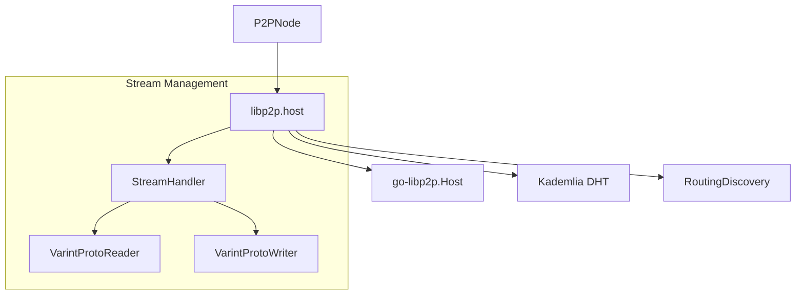

# Libp2p Transport

The Libp2p transport is the default communication stack for the Fabric Smart Client. It leverages the industry-standard `libp2p` library to provide a decentralized, robust, and highly configurable P2P networking layer.

## Overview

Libp2p is used when nodes need to operate in a truly decentralized environment where peer discovery, NAT traversal, and DHT-based routing are required.

### Key Characteristics
- **DHT Routing**: Uses Kademlia DHT for peer discovery and content routing.
- **Multi-protocol Support**: Can run over TCP, QUIC, and other transports.
- **Security**: Supports Noise and TLS security handshakes.
- **Identity**: Peer IDs are derived from the node's cryptographic public key.

## Internal Architecture

The Libp2p transport implementation is centered around the `libp2p.host` struct.

### Component Diagram



### Message Dispatching

When a new stream is opened to a node, libp2p triggers the registered stream handler:

1.  **Protocol Negotiation**: The requester and receiver agree on the protocol version (`/fsc/view/1.0.0`).
2.  **Stream Wrapping**: The raw libp2p stream is wrapped into an `fsc.stream` object, which provides a unified interface for the Comm layer.
3.  **Peer Info Extraction**: The remote Peer ID and Multiaddress are extracted from the underlying connection.
4.  **Handling**: The `P2PNode` receives the new stream and starts a `streamHandler` goroutine to read `ViewPacket` messages.

## Security and Identity

In Libp2p mode, the `PeerID` is the primary identifier. 

-   **TLS Identity**: The transport uses the node's main identity key (configured via `fsc.identity.key.file`) for the security handshake.
-   **Handshake**: Libp2p performs its own security handshake (Noise or TLS).
-   **Identity Binding**: The `PeerID` used by libp2p is cryptographically linked to the public key used during the handshake. The Comm layer uses `s.Conn().RemotePeer().String()` as the source of truth for the remote identity.

## Performance and Hardening

-   **Connection Manager**: Configured with a "low water mark" of 100 and a "high water mark" of 400 connections to prevent resource exhaustion.
-   **Read Limits (OOM Protection)**: Incoming messages are limited to 10MB to prevent remote memory exhaustion attacks. The system reads the varint-encoded length prefix and validates it before allocating the target buffer.
-   **Stream Recycling**: The `StreamHash` for libp2p is simply the `RemotePeerID`. This allows the system to reuse existing streams to the same peer for multiple logical sessions.

## Trust and Access Control

In libp2p mode, nodes establish trust through the exchange of public keys:
- **Noise Handshake**: All connections use the Noise protocol (or TLS) where both sides exchange public keys.
- **Identity Verification**: The `PeerID` of the remote node is checked against the local node's trusted set (from static configuration or dynamic `EndpointService` resolutions).
- **Public Key Invariant**: The connection is only accepted if the remote party can cryptographically prove possession of the private key corresponding to its identity.

Libp2p is configured via the `fsc.p2p` section in `core.yaml`. For a complete configuration reference, see [Configuration Guide](../../../configuration.md#fsc-node-configuration).

```yaml
fsc:
  p2p:
    # Transport type must be "libp2p"
    type: libp2p
    # Address to listen for incoming libp2p connections
    # See https://github.com/libp2p/specs/blob/master/addressing/README.md
    listenAddress: /ip4/0.0.0.0/tcp/11511
    
    opts:
      # ------------------- libp2p specific options -------------------------
      libp2p:
        # bootstrap node
        # if it's empty then this node is the bootstrap node, otherwise it's the name
        # of the bootstrap node, which must be defined in the FSC endpoint resolvers section
        # and that entry must have an address with an entry P2P.
        bootstrapNode: theBootstrapNode
        # Connection manager settings for libp2p
        connManager:
          # Low water mark - when the number of connections drops below this, the connection manager
          # will not prune any connections. Default: 100
          lowWater: 100
          # High water mark - when the number of connections exceeds this, the connection manager
          # will prune connections until it reaches the low water mark. Default: 400
          highWater: 400
          # Grace period - connections younger than this will not be pruned. Default: 60s
          # Format: duration in seconds
          gracePeriod: 60
  
  identity:
    key:
      # Path to the node's private key used for libp2p security handshake
      file: ./path/to/key.pem
```

## Code References

| Feature | File Path |
| :--- | :--- |
| Host Implementation | `platform/view/services/comm/host/libp2p/host.go` |
| Stream Wrapper | `platform/view/services/comm/host/libp2p/stream.go` |
| Configuration | `platform/view/services/comm/host/libp2p/provider.go` |
| Protobuf Reader | `pkg/utils/io/reader.go` |
| Metrics | `platform/view/services/comm/host/libp2p/metrics.go` |

## Bootstrapping for AI Agents

To understand how messages move through libp2p:
1.  Start at `platform/view/services/comm/p2p.go`: `handleStream` is where libp2p streams enter the FSC logic.
2.  Look at `platform/view/services/comm/host/libp2p/host.go`: `NewStream` shows how FSC initiates outbound connections using libp2p.
3.  Check `platform/view/services/comm/host/libp2p/provider.go`: `NewHostGeneratorProvider` shows how the libp2p stack is initialized from configuration.
