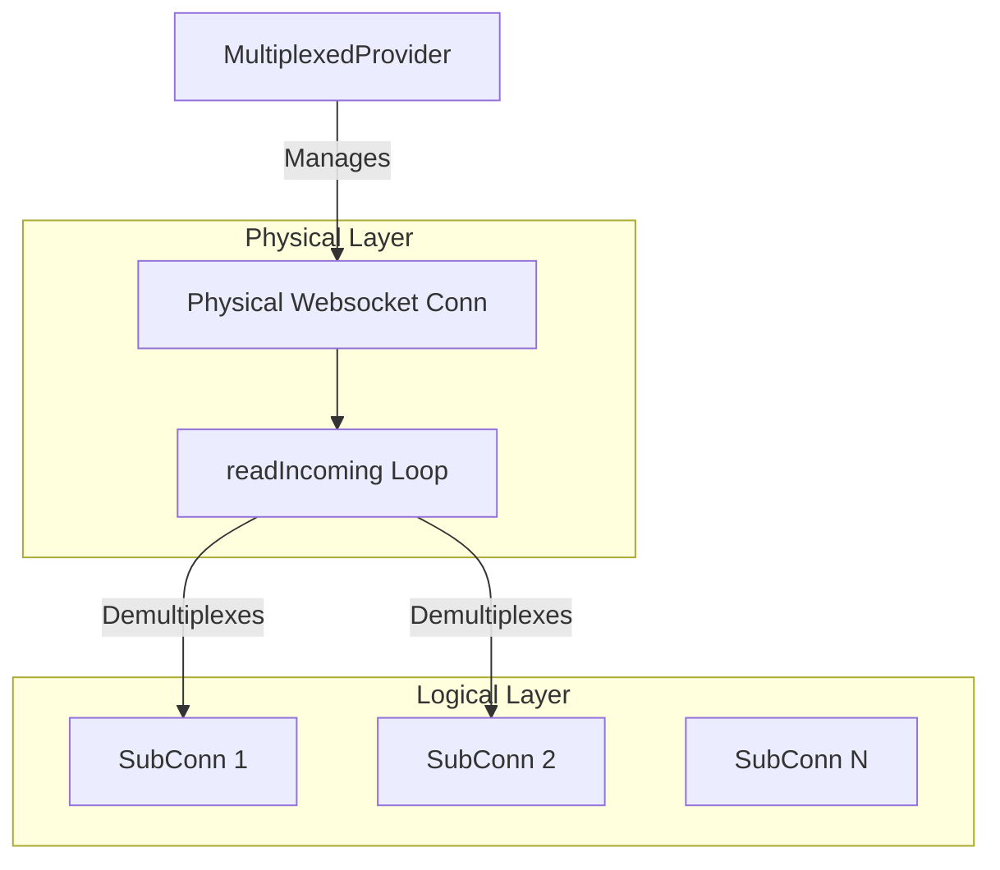

# Multiplexed WebSocket Provider Specification

## Overview

The `MultiplexedProvider` allows multiple logical P2P streams to share a single physical WebSocket connection. This reduces the overhead of establishing new TCP/TLS connections for every logical session between peers.

## Architecture

### Components

1.  **MultiplexedProvider**: Manages the lifecycle of physical connections (`multiplexedClientConn` / `multiplexedServerConn`). It maintains a registry of active connections to remote peers.
2.  **Physical Connection** (`multiplexedBaseConn`): Wraps a standard `websocket.Conn` with 1MB read/write buffers. It runs a read loop (`readIncoming`) that demultiplexes incoming messages.
3.  **Sub-Connection** (`subConn`): Represents a logical stream. It has a unique `ID` scoped to the physical connection and a 10,240-slot message buffer to prevent head-of-line blocking.
4.  **Stream Wrapper** (`websocket.stream`): Implements `host.P2PStream`. It handles context cancellation, returns `io.ErrClosedPipe` on closed writes, and ensures atomic framing (via `delimitedReader`).

### Diagram



## Protocol

### Multiplexed Message
All messages sent over the physical WebSocket are JSON-encoded `MultiplexedMessage` structures.

```go
type MultiplexedMessage struct {
    ID  string `json:"id"`  // The ID of the sub-connection
    Msg []byte `json:"msg"` // The payload (Base64 encoded by JSON)
    Err string `json:"err"` // Error signal (e.g., "EOF" or custom error)
}
```

### Handshake & Stream Establishment

1.  **Physical Connection**: Established via standard HTTP/HTTPS upgrade to WebSocket.
2.  **Logical Stream Creation (Client)**:
    -   Allocates a new unique `ID`.
    -   Sends a `MultiplexedMessage` with `ID` and `Msg` containing the `StreamMeta` (JSON).
    -   `StreamMeta` contains: `ContextID`, `SessionID`, `PeerID` (sender's identity), and `SpanContext`.
3.  **Logical Stream Acceptance (Server)**:
    -   Receives the first message for a new `ID`.
    -   Unmarshals `Msg` as `StreamMeta`.
    -   **Identity Binding Check**: Verifies that `StreamMeta.PeerID` matches the `expectedPeerID` derived from the TLS certificate of the physical connection.
    -   If valid, creates a `subConn` and invokes the registered handler **in a separate goroutine**.
    -   The sub-connection is automatically closed when the handler function returns.
    -   If invalid, sends an error back and closes the physical connection (security violation).

### Data Transfer
-   **Write**: The `subConn` uses a `delimitedReader` accumulator to ensure that each application-level frame (including varint length) is sent as a **single, complete WebSocket binary message**. This prevents partial frames from being misinterpreted by the remote peer.
-   **Read**: The `readIncoming` loop receives a `MultiplexedMessage`, looks up the `subConn` by `ID`, and delivers the `Msg` to the sub-connection's channel.

### Connection Closure

1.  **Sub-Connection Close**:
    -   Local: `subConn.Close()` is called. It cancels the stream context and sends a `MultiplexedMessage` with `Err: "EOF"` to the remote peer. Subsequent writes return `io.ErrClosedPipe`.
    -   Remote: A message with `Err != ""` is received. The local `subConn` is closed, and `io.EOF` (or the specific error) is delivered to the reader.

2.  **Physical Connection Close**:
    -   Occurs on network error, explicit `Kill()`, or security violation.
    -   Closes the underlying WebSocket.
    -   Closes **all** active `subConn`s.
    -   Cancels the `Context` associated with each stream.

## Error Handling

| Scenario | Action | Consequence |
| :--- | :--- | :--- |
| **Malformed JSON** (Physical) | Log error, return from loop. | Implementation kills the physical connection. This is necessary for protocol integrity. |
| **Unknown ID** (Server) | Treat as new stream request. | Tries to parse as `StreamMeta`. |
| **Unknown ID** (Client) | Log warning and drop. | Late messages for closed streams are ignored. |
| **Identity Mismatch** | Log error, send error frame. | **MUST** kill physical connection (prevent spoofing). |
| **Max SubConns Reached** | Send error frame. | Reject new stream, keep physical connection alive. |
| **SubConn Read Timeout** | N/A | Handled by `Stream` layer logic via read deadlines. |

## Concurrency Model

-   **Physical Write Lock**: A single mutex protects writes to the physical WebSocket (`writeMu`).
-   **Clients Map Lock**: `MultiplexedProvider.mu` protects the map of active physical connections.
-   **SubConns Map Lock**: `multiplexedBaseConn.mu` (RWMutex) protects the registry of logical streams.
-   **Asynchronous Handlers**: Server handlers are decoupled from the physical read loop via goroutines, ensuring a single slow stream doesn't block the entire physical connection.
-   **Safe Delivery**: `deliver` operations have a 5-second timeout to prevent "zombie" streams from hanging the physical read loop during backpressure.

## Known Issues / Invariants

1.  **Race Condition (New Stream)**: A client may send data immediately after the `StreamMeta` packet. If the server is slow to process the `StreamMeta`, it must not drop the subsequent data packets or treat them as invalid new stream requests.
2.  **Late Messages**: Messages for closed streams (zombies) must be safely dropped without killing the physical connection.
