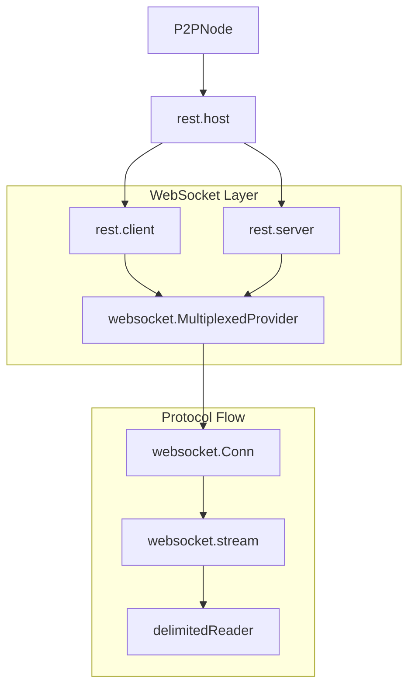

# REST / WebSocket Transport

The REST/WebSocket transport provides a secure, lightweight, and firewall-friendly communication channel. It uses standard HTTP/HTTPS for handshakes and then upgrades to WebSockets for full-duplex P2P communication.

## Overview

This transport is designed for deployments where standard web ports are preferred over custom P2P ports. It features built-in multiplexing to minimize the overhead of opening multiple connections between nodes.

### Key Characteristics
- **HTTPS Handshake**: Initial connection and authentication happen over standard HTTP(S).
- **WebSocket Upgrade**: Connections are upgraded to WebSockets for persistent, full-duplex messaging.
- **Multiplexing**: Multiple logical FSC streams are multiplexed over a single physical WebSocket.
- **Mutual TLS**: mTLS is mandatory and strictly enforced for both server and client authentication (`tls.RequireAndVerifyClientCert`).
- **Dynamic Port Assignment**: The transport supports starting on a dynamic port (by setting the port to `0` in `listenAddress`). The actual assigned port is automatically retrieved and used for service discovery and readiness checks.

## Internal Architecture

The REST transport implementation is built on top of the standard Go `net/http` server and the `gorilla/websocket` library.

### Component Diagram



### Protocol Handshake and Upgrading

1.  **TCP/TLS Connect**: The client establishes a TLS connection to the server's REST endpoint (e.g., `https://node-a:11511/p2p`).
2.  **mTLS Identity**: Both parties use the node's main identity (configured via `fsc.identity.key.file` and `fsc.identity.cert.file`) for mutual authentication.
3.  **mTLS Verification**: Both parties exchange and verify certificates. The server extracts the `expectedPeerID` from the client's verified certificate.
4.  **WebSocket Upgrade**: The client sends an `Upgrade: websocket` header.
5.  **Meta Handshake**: Once the WebSocket is established, the client sends an initial `StreamMeta` JSON packet containing its claimed `PeerID`, `ContextID`, and `SessionID`.
6.  **Identity Binding Validation**: The server compares the `PeerID` in the `StreamMeta` against the `expectedPeerID` from the TLS certificate. If they mismatch, the connection is terminated.

## Multiplexing and Logical Streams

A single physical WebSocket can carry multiple "logical" streams. Each logical stream is identified by a unique `ID` in a `MultiplexedMessage` wrapper. For more details on the multiplexing protocol, see the [Multiplexer Specification](./multiplexer.md).

### Multiplexed Message Format
```go
type MultiplexedMessage struct {
    ID  string // Unique ID for this sub-connection
    Msg []byte // Raw payload (delimited ViewPacket)
    Err string // Error message if the operation failed
}
```

-   **Client Side**: Uses `newClientSubConn` to initiate a sub-connection. It increments a local counter to generate new IDs.
-   **Server Side**: Uses `newServerSubConn` when it receives a `MultiplexedMessage` with a new `ID`.
-   **Limits**: Enforced by `maxSubConns` (default 100) per physical connection to prevent resource exhaustion.

## Performance and Security

-   **TLS Caching**: Trusted root CAs are cached in memory to avoid disk I/O during handshakes. Dynamic trust updates (from the `EndpointService`) are appended to a clone of this cached pool in memory, significantly improving connection throughput.
-   **Identity Binding (Issue #871)**: The `PeerID` asserted in the application layer (during the WebSocket upgrade) is strictly validated against the public key extracted from the verified TLS certificate. The transport layer rejects any attempt to spoof an identity.
-   **Runtime Trust Updates**: The transport dynamically integrates with the `EndpointService`. Any peer public key added to the `EndpointService` at runtime is automatically added to the trusted CA pool for both inbound and outbound connections.
-   **Read Limits**: Each WebSocket connection has a 10MB read limit (`SetReadLimit`) to prevent OOM attacks.
-   **WebSocket Hardening**:
    -   **Binary Enforcement**: All WebSocket messages are sent as binary packets.
    -   **Deadlines**: Uses read/write deadlines and pong handlers to detect and close stalled connections.
    -   **Multiplexing Limits**: Enforced by `maxSubConns` (default 100) per physical connection to prevent resource exhaustion.
-   **CORS Protection**: Enforces "Same-Origin" policy for browser-based connections by default.
-   **Defensive Timeouts**: The HTTP server includes strict timeouts:
    -   `ReadHeaderTimeout`: 10s
    -   `ReadTimeout`: 30s
    -   `WriteTimeout`: 30s
    -   `IdleTimeout`: 120s

## Trust and Access Control

A remote node can only connect if its TLS certificate is trusted by the local server:
- **Server Side**: Only clients presenting a certificate signed by a CA in `fsc.p2p.opts.tls.clientRootCAs` (or dynamically added via `EndpointService`) are permitted.
- **Client Side**: The local node will only connect to servers whose certificates match the `serverRootCAs` or a dynamically retrieved peer public key.
- **Identity Enforcement**: The server extracts the `PeerID` from the client certificate and compares it against the application-layer `PeerID` in the `StreamMeta` packet (Identity Binding). If they don't match, the connection is terminated.

The REST/WebSocket transport is configured via the `fsc.p2p` section in `core.yaml`. For a complete configuration reference, see [Configuration Guide](../../../configuration.md#fsc-node-configuration).

```yaml
fsc:
  p2p:
    # Transport type must be "websocket" or "rest"
    type: websocket
    # Address to listen for incoming connections. 
    # Use "0.0.0.0:0" for dynamic port assignment.
    listenAddress: 0.0.0.0:11511
    
    opts:
      # ------------------- websocket specific options -------------------------
      websocket:
        # Maximum number of sub-connections per peer. Default: 100
        maxSubConns: 100
        # Comma-separated list of allowed origins for CORS (Cross-Origin Resource Sharing)
        # Example: "https://example.com,https://app.example.com"
        # If not set, CORS is disabled
        corsAllowedOrigins: ""
        # TLS configuration for websocket connections
        tls:
          # Whether clients are required to provide certificates.
          # Defaults to true for websocket p2p when omitted.
          clientAuthRequired: true
          # Root certificates used by this node (as a websocket client) to verify remote server certificates.
          serverRootCAs:
            files:
              - /path/to/server/tls/ca.crt
          # Root certificates used by this node (as a websocket server) to verify remote client certificates.
          clientRootCAs:
            files:
              - /path/to/client/tls/ca.crt
  
  identity:
    # Path to the node's key and certificate used for mTLS handshake
    key:
      file: ./path/to/key.pem
    cert:
      file: ./path/to/cert.pem
```

## Code References

| Feature | File Path |
| :--- | :--- |
| REST Host Implementation | `platform/view/services/comm/host/rest/host.go` |
| WebSocket Multiplexer | `platform/view/services/comm/host/rest/websocket/multiplexed_provider.go` |
| mTLS Auth and Identity Extraction | `platform/view/services/comm/host/rest/websocket/auth.go` |
| WebSocket Stream Wrapper | `platform/view/services/comm/host/rest/websocket/stream.go` |
| Delimited Proto Reader | `platform/view/services/comm/host/rest/websocket/streamreader.go` |
| CA Pool Caching | `platform/view/services/comm/host/rest/config.go` |

## Bootstrapping for AI Agents

To follow the message flow in the REST transport:
1.  **Outgoing**: `platform/view/services/comm/host/rest/client.go` calls `OpenStream`, which uses the `MultiplexedProvider` to either get a sub-connection or open a new WebSocket.
2.  **Incoming**: `platform/view/services/comm/host/rest/server.go` registers a handler on `/p2p`. The handler calls `NewServerStream` in `MultiplexedProvider`.
3.  **Data Encoding**: Note that `websocket.stream` uses a `delimitedReader` to ensure that raw protobuf packets are correctly framed within WebSocket binary messages.
