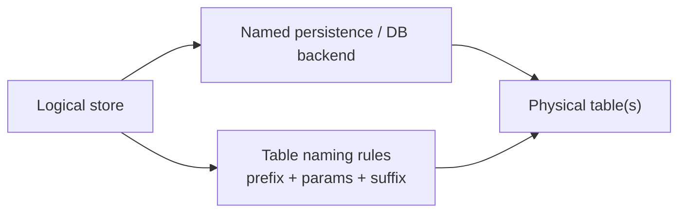

# Database Layout

## Overview

This document describes the physical database layout created by an FSC node.
It focuses on the concrete tables, naming rules, and stored data shapes used by the current implementation.
Unless otherwise noted, the examples and default names below refer to the standard generated node path with the default table prefix and default store parameters.

- [Database drivers](db-driver.md) explains persistence, store, and driver concepts
- [Runtime DB access](runtime-db-access.md) explains how application code and operators access persisted data at runtime
- this document explains what tables and columns exist in the underlying database

## How FSC Storage Maps to Tables

At a high level, FSC storage is organized in layers:

The important pieces are:

- a **store** is the logical API used by the runtime, such as KVS, BindingStore, or the Fabric vault
- a **persistence** is the configured backend selection under `fsc.persistences`
- a **table prefix** is part of the persistence options and affects the final physical table names
- a store may use one table or multiple tables depending on its semantics

For background on these concepts, see [Database drivers](db-driver.md).

## Table Naming

Table names are built from:

1. the configured `tablePrefix` for the selected persistence
2. a store-specific suffix such as `kvs`, `bind`, `env`, or `vstate`
3. optional naming parameters such as `default`, network name, or channel name

If no `tablePrefix` is set, FSC uses `fsc`.

### Parameter Escaping

When table names include parameters, FSC escapes special characters before composing the final name:

| Character | Escaped form |
| --- | --- |
| `_` | `__` |
| `-` | `_d` |
| `.` | `_f` |

With the default prefix `fsc`:

- `kvs` becomes `fsc_kvs`
- parameter `default` plus suffix `bind` becomes `fsc_default_bind`
- parameters `default`, `testchannel` plus suffix `vstate` becomes `fsc_default__testchannel_vstate`

## Logical Store Map

The following table summarizes the main logical stores and their default physical table names in a generated node:

| Platform | Logical store | Config key | Default params | Default table name or pattern |
| --- | --- | --- | --- | --- |
| View | KVS | `fsc.kvs.persistence` | none | `fsc_kvs` |
| View | BindingStore | `fsc.binding.persistence` | `default` | `fsc_default_bind` |
| View | SignerInfoStore | `fsc.signerinfo.persistence` | `default` | `fsc_default_sign` |
| View | AuditInfoStore | `fsc.auditinfo.persistence` | `default` | `fsc_default_aud` |
| Fabric | EnvelopeStore | `fsc.envelope.persistence` | `default` | `fsc_default_env` |
| Fabric | MetadataStore | `fsc.metadata.persistence` | `default` | `fsc_default_meta` |
| Fabric | EndorseTxStore | `fsc.endorsetx.persistence` | `default` | `fsc_default_etx` |
| Fabric | Vault status | `fabric.<network>.vault.persistence` | network, channel | `<prefix>_<params>_vstatus` |
| Fabric | Vault state | `fabric.<network>.vault.persistence` | network, channel | `<prefix>_<params>_vstate` |

## View Platform Tables

### KVS

The View KVS is the general-purpose namespaced key/value store used by the View platform and by applications that build storage-backed services on top of it.

Default table:

- `fsc_kvs`

Schema:

| Column | Meaning |
| --- | --- |
| `ns` | logical namespace |
| `pkey` | persisted key bytes |
| `val` | persisted value bytes |

Notes:

- the primary key is `(pkey, ns)`
- the database layer stores raw bytes
- at the higher `kvs.KVS` API layer, values are often JSON-marshaled before they are persisted

### BindingStore

The binding store maps an ephemeral identity identifier to the corresponding long-term identity bytes.

Default table:

- `fsc_default_bind`

Schema:

| Column | Meaning |
| --- | --- |
| `ephemeral_hash` | unique ID derived from the ephemeral identity |
| `long_term_id` | serialized long-term identity bytes |

Notes:

- `ephemeral_hash` is the primary key
- both columns belong to FSC identity-binding semantics 

### SignerInfoStore

The signer info store tracks known signer unique IDs.

Default table:

- `fsc_default_sign`

Schema:

| Column | Meaning |
| --- | --- |
| `id` | signer unique ID returned by `view.Identity.UniqueID()` |

Notes:

- `id` is the primary key
- this is effectively a registry table for known signer unique IDs

### AuditInfoStore

The audit info store maps an identity-derived unique ID to audit bytes associated with that identity.

Default table:

- `fsc_default_aud`

Schema:

| Column | Meaning |
| --- | --- |
| `id` | identity-derived unique ID returned by `view.Identity.UniqueID()` |
| `audit_info` | audit bytes for that identity |

Notes:

- `id` is the primary key
- `audit_info` is opaque from the point of view of direct DB inspection

## Fabric Auxiliary Tables

Fabric adds three persistence-backed auxiliary stores in addition to the local vault.  
They all use the same physical table shape: a logical transaction key mapped to opaque payload bytes.

| Store | Default table | Payload |
| --- | --- | --- |
| EnvelopeStore | `fsc_default_env` | Fabric envelope bytes |
| MetadataStore | `fsc_default_meta` | JSON-marshaled metadata bytes |
| EndorseTxStore | `fsc_default_etx` | opaque transaction bytes |

### Shared Schema

| Column | Meaning |
| --- | --- |
| `key` | logical transaction key |
| `data` | opaque payload bytes |

Notes:

- `key` is the primary key
- the logical key format is `network.channel.txid`
- metadata rows are JSON-marshaled at the metadata service boundary

## Fabric Vault Tables

The Fabric vault is the main local SQL-backed state store for Fabric applications.
It uses two tables per network and channel:

- `vstatus`
- `vstate`

For a network named `default` and a channel named `testchannel`, the generated tables are typically:

- `fsc_default__testchannel_vstatus`
- `fsc_default__testchannel_vstate`

### Transaction Status Table

Schema:

| Column | Meaning |
| --- | --- |
| `pos` | auto-generated row identifier |
| `tx_id` | transaction ID |
| `code` | transaction status code |
| `message` | status or error message |

Notes:

- `tx_id` is unique and indexed
- FSC uses this table to track status transitions such as unknown, busy, valid, or invalid

### Vault State Table

Schema:

| Column | Meaning |
| --- | --- |
| `ns` | namespace |
| `pkey` | persisted state key |
| `val` | raw value bytes |
| `kversion` | version bytes for the key |
| `metadata` | encoded metadata bytes |

Notes:

- the primary key is `(pkey, ns)`
- `metadata` is stored as encoded bytes
- metadata values are marshaled from a `map[string][]byte`
- unlike the View KVS, the vault state table is the main persisted application state surface for many Fabric applications

## Backend Differences

The logical layout is the same across supported SQL backends, but some physical SQL details differ.

| Area | SQLite | Postgres |
| --- | --- | --- |
| Vault `pos` column | `INTEGER PRIMARY KEY` | `SERIAL PRIMARY KEY` |
| Vault byte columns | `val`, `kversion`, and `metadata` default to empty byte values | stored as `BYTEA` without SQLite-style empty defaults |
| String handling | uses a no-op sanitizer for vault namespace and key text | sanitizes vault namespace and key strings before persistence |

These differences do not change the logical meaning of the data, but they matter when directly inspecting tables or writing backend-specific SQL.
