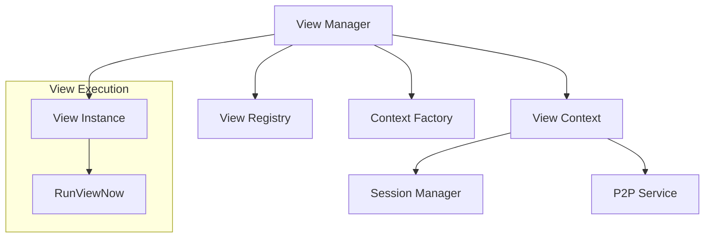
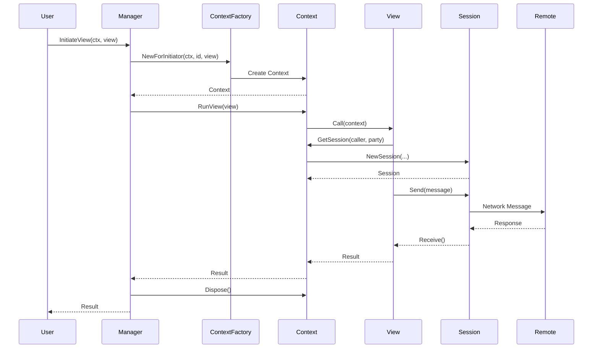
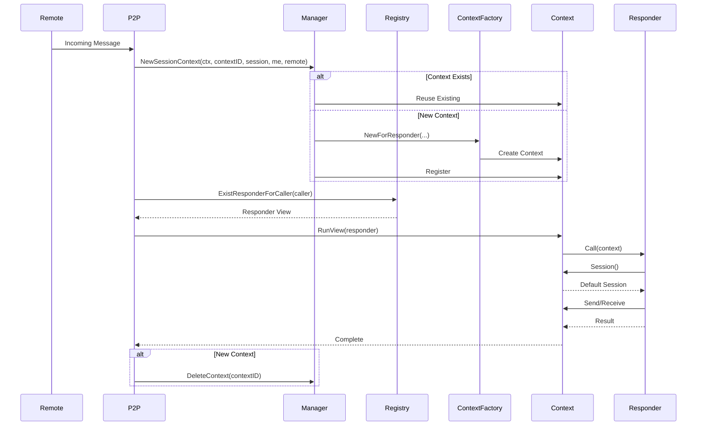
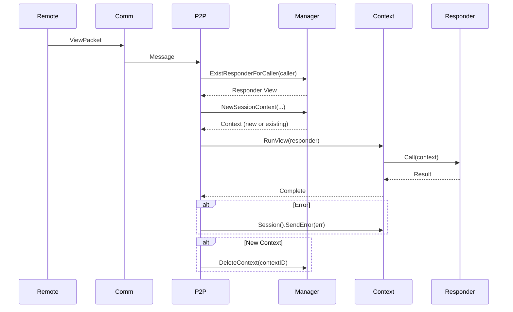

# View Service

The View Service is the core orchestration layer of the Fabric Smart Client (FSC) that manages the lifecycle of views, contexts, and inter-node communication protocols. It provides a high-level abstraction for executing business logic through views while handling session management, identity resolution, and distributed protocol coordination.

## Overview

The View Service enables developers to write business logic as "views" - self-contained units of work that can initiate protocols, respond to requests, and communicate with other FSC nodes. The service manages:

- **View Lifecycle**: Creation, execution, and cleanup of view instances
- **Context Management**: Isolated execution environments for views with session and identity management
- **Protocol Coordination**: Initiator/responder patterns for distributed protocols
- **Session Management**: Multiplexed communication channels between nodes
- **Registry**: Factory pattern for view instantiation and responder registration

## Architecture

### Core Components



#### View Manager

The `Manager` is the central orchestrator responsible for:

- **Context Lifecycle**: Creating, tracking, and disposing view contexts
- **View Instantiation**: Delegating to the registry to create view instances
- **Protocol Initiation**: Starting new protocols as an initiator
- **Responder Coordination**: Creating contexts for incoming protocol requests
- **Metrics**: Tracking active contexts and view executions

**Key Methods:**
- `InitiateView(ctx, view)`: Starts a new protocol with the given view as initiator
- `InitiateContext(ctx, view)`: Creates a context for a view without executing it
- `NewSessionContext(ctx, contextID, session, me, remote)`: Creates or reuses a context for responding to a remote request
- `RegisterFactory(id, factory)`: Registers a factory for creating views by ID
- `RegisterResponder(responder, initiatedBy)`: Registers a responder view for a given initiator

#### View Context

The `Context` provides the execution environment for views, implementing the `view.Context` interface:

**Identity & Session Management:**
- `Me()`: Returns the local identity bound to this context
- `IsMe(id)`: Checks if an identity is local to this node
- `Session()`: Returns the default session (for responders)
- `GetSession(caller, party)`: Gets or creates a session to a remote party
- `GetSessionByID(id, party)`: Gets a session by explicit ID

**Service Access:**
- `GetService(type)`: Retrieves services (local context-scoped or global)
- `PutService(service)`: Registers a service in the local context scope

**View Execution:**
- `RunView(view, opts...)`: Executes a view within this context
- `Initiator()`: Returns the initiator view (if this is an initiator context)

**Lifecycle:**
- `OnError(callback)`: Registers cleanup callbacks for error handling
- `Dispose()`: Releases all resources (sessions, callbacks)

#### Context Factory

The `ContextFactory` creates view contexts with proper initialization:

- `NewForInitiator(ctx, contextID, id, view)`: Creates a context for an initiator view
- `NewForResponder(ctx, contextID, me, session, remote)`: Creates a context for a responder view

The factory wires together:
- Service provider (global services)
- Session factory (for creating communication sessions)
- Endpoint service (for identity resolution)
- Identity provider (for local identities)
- Tracer (for observability)

#### View Registry

The `Registry` manages view factories and responder mappings:

**Factory Registration:**
- `RegisterFactory(id, factory)`: Maps a view ID to a factory
- `NewView(id, input)`: Creates a view instance using the registered factory

**Responder Registration:**
- `RegisterResponder(responder, initiatedBy)`: Maps an initiator to a responder view
- `RegisterResponderWithIdentity(responder, id, initiatedBy)`: Maps with a specific identity
- `GetResponder(initiatedBy)`: Retrieves the responder for an initiator
- `ExistResponderForCaller(caller)`: Checks if a responder exists for a caller ID

**View Identification:**
- Uses reflection to generate unique identifiers: `<package>/<type>`
- Caches identifiers for performance

#### Session Manager

The `Sessions` component manages communication sessions within a context:

- **Session Caching**: Sessions are cached by `(viewID, partyID)` tuple
- **Session Reuse**: Existing open sessions are reused when possible
- **Session Lifecycle**: Tracks session state (open/closed)
- **Default Session**: Responder contexts have a default session from the initiator

**Key Operations:**
- `Put(viewID, party, session)`: Caches a session
- `Get(viewID, party)`: Retrieves a cached session
- `GetFirstOpen(viewID, parties)`: Finds the first open session from a list of party identities
- `Reset()`: Clears all sessions

## View Lifecycle

### Initiator Flow



**Steps:**

1. **Initiation**: User calls `Manager.InitiateView(ctx, view)`
2. **Context Creation**: Manager creates a new context via `ContextFactory.NewForInitiator`
3. **Context Registration**: Manager registers the context in its internal map
4. **View Execution**: Manager calls `Context.RunView(view)` which invokes `view.Call(context)`
5. **Session Creation**: View requests sessions via `context.GetSession(caller, party)`
6. **Communication**: View sends/receives messages through sessions
7. **Completion**: View returns result
8. **Cleanup**: Manager calls `context.Dispose()` and removes context from map

### Responder Flow



**Steps:**

1. **Message Arrival**: P2P service receives an incoming message
2. **Context Resolution**: P2P calls `Manager.NewSessionContext` to get or create a context
3. **Responder Lookup**: P2P queries `Registry.ExistResponderForCaller` to find the responder view
4. **View Execution**: P2P runs the responder view in the context
5. **Session Access**: Responder accesses the default session via `context.Session()`
6. **Communication**: Responder sends/receives messages through the session
7. **Completion**: Responder returns result
8. **Cleanup**: If a new context was created, P2P deletes it

## Context Types

### Parent Context

The `Context` struct is the main implementation of `view.Context` and `ParentContext`. It provides:

- Full context functionality
- Session management
- Service provider integration
- Error callback registration
- Cleanup and disposal

### Child Context

The `ChildContext` wraps a parent context to provide:

- **Session Override**: Can override the default session
- **Initiator Override**: Can override the initiator view
- **Error Callbacks**: Maintains its own list of error callbacks
- **Delegation**: Delegates most operations to the parent

**Use Cases:**
- Running a view with a different session
- Temporarily acting as an initiator from a responder context
- Isolating error handling for nested view executions

### Wrapped Context

The `WrappedContext` wraps a parent context to provide a different `context.Context`:

- Overrides the Go context while delegating all other operations
- Used for propagating cancellation, deadlines, and trace spans
- Maintains the same view context semantics

## Session Management

### Session Lifecycle

1. **Creation**: Sessions are created via `SessionFactory.NewSession` or `NewSessionWithID`
2. **Caching**: Sessions are cached in the context's `Sessions` manager
3. **Reuse**: Existing open sessions are reused when `GetSession` is called
4. **Closure**: Sessions are closed when the context is disposed
5. **Cleanup**: Session factory deletes sessions by ID

### Session Scoping

Sessions are scoped by:
- **View ID**: The identifier of the calling view
- **Party ID**: The identity of the remote party

This allows different views to have independent sessions to the same party.

### Session Resolution

When `GetSession(caller, party)` is called:

1. Check for cached session by `(viewID, party)`
2. If found and open, return it
3. If not found, resolve the party identity:
   - Try the party identity as-is
   - Try resolving via endpoint service
   - Try resolving as a label via identity provider
4. Create a new session to the resolved identity
5. Cache and return the session

## View Execution

### RunViewNow

The `RunViewNow` function is the core view execution engine:

```go
func RunViewNow(parent ParentContext, v View, opts ...view.RunViewOption) (interface{}, error)
```

**Execution Flow:**

1. **Option Compilation**: Parse run options (AsInitiator, AsResponder, SameContext, etc.)
2. **Context Selection**: Use parent context or create a child context based on options
3. **Tracing**: Start a new trace span for the view execution
4. **Context Creation**:
   - If `SameContext`: Wrap parent with new Go context
   - If `AsInitiator`: Create child context with initiator set
   - Otherwise: Create child context with optional session override
5. **Panic Recovery**: Wrap execution in defer/recover to handle panics
6. **View Invocation**: Call `view.Call(context)` or execute the provided call function
7. **Error Handling**: On error, call `context.Cleanup()` to invoke error callbacks
8. **Result Return**: Return the view's result

### Run Options

- `AsInitiator()`: Run as an initiator (sets `context.Initiator()`)
- `AsResponder(session)`: Run as a responder with a specific session
- `WithViewCall(func)`: Execute a function instead of `view.Call`
- `SameContext`: Reuse the parent context without creating a child
- `WithContext(ctx)`: Use a specific Go context

### Helper Functions

- `Initiate(context, view)`: Shortcut for initiating a new protocol
- `AsResponder(context, session, func)`: Temporarily act as a responder
- `AsInitiatorCall(context, initiator, func)`: Temporarily act as an initiator
- `RunCall(context, func)`: Execute a function as a view

## Error Handling

### Error Callbacks

Contexts support registering error callbacks via `OnError(callback)`:

- Callbacks are invoked when a view execution fails or panics
- Callbacks are invoked in registration order
- Callbacks are protected by panic recovery
- Useful for resource cleanup (closing files, releasing locks, etc.)

### Cleanup Process

When a view execution fails:

1. `RunViewNow` catches the error or panic
2. Calls `context.Cleanup()` to invoke all error callbacks
3. Returns the error to the caller

When a context is disposed:

1. `Manager.DeleteContext` is called
2. Calls `context.Dispose()` to release resources
3. Deletes all sessions via `SessionFactory.DeleteSessions`
4. Removes the context from the manager's map

### Panic Recovery

All view executions are wrapped in panic recovery:

- Panics are caught and converted to errors
- Stack traces are logged
- Error callbacks are still invoked
- The error is returned to the caller

## Service Provider

### Global Services

The context has access to global services via `services.Provider`:

- Registered at the application level
- Shared across all contexts
- Retrieved via `context.GetService(type)`

### Local Services

Each context has a local `ServiceProvider`:

- Scoped to the context
- Registered via `context.PutService(service)`
- Retrieved first before checking global services
- Useful for context-specific dependencies (e.g., web streams)

### Service Resolution

When `GetService(type)` is called:

1. Check local service provider
2. If found, return it
3. If not found, check global service provider
4. Return error if not found in either

## Integration with P2P Service

The View Service integrates with the P2P Service for handling incoming messages:

### P2P Service Responsibilities

1. **Message Reception**: Listens on the master session for incoming messages
2. **Responder Lookup**: Queries the registry for the appropriate responder view
3. **Context Creation**: Calls `Manager.NewSessionContext` to get or create a context
4. **View Execution**: Runs the responder view in the context
5. **Error Handling**: Sends error messages back to the initiator on failure

### Message Flow



## Best Practices

### View Development

1. **Keep Views Focused**: Each view should have a single, well-defined purpose
2. **Use Sessions Wisely**: Cache sessions when possible, but be aware of their scope
3. **Handle Errors Gracefully**: Use `OnError` callbacks for cleanup
4. **Avoid Long-Running Operations**: Views should complete in a reasonable time
5. **Use Tracing**: Leverage the built-in tracing for observability

### Context Management

1. **Always Dispose**: Ensure contexts are disposed when no longer needed
2. **Use Child Contexts**: For nested view executions or temporary role changes
3. **Register Services Locally**: Use local services for context-specific dependencies
4. **Avoid Context Leaks**: The manager tracks contexts; ensure they're deleted

### Session Management

1. **Reuse Sessions**: Let the context cache and reuse sessions
2. **Close Explicitly**: Call `session.Close()` when done (or rely on context disposal)
3. **Handle Session Errors**: Sessions can fail; handle errors appropriately
4. **Understand Scoping**: Sessions are scoped by view and party

### Error Handling

1. **Register Cleanup Callbacks**: Use `OnError` for resource cleanup
2. **Handle Panics**: The framework recovers panics, but avoid them when possible
3. **Log Errors**: Use the logger for debugging
4. **Return Meaningful Errors**: Provide context in error messages

## Configuration

The View Service is configured through the FSC configuration file. Key settings include:

- **Identity Configuration**: Default identity and identity provider settings
- **Session Configuration**: Session factory and communication layer settings
- **Tracing Configuration**: OpenTelemetry tracing provider settings
- **Metrics Configuration**: Prometheus metrics provider settings

See the [Configuration Guide](../../../configuration.md) for detailed configuration options.

## Observability

### Metrics

The View Service exports Prometheus metrics:

- `contexts`: Current number of active contexts (gauge)

### Tracing

The View Service integrates with OpenTelemetry for distributed tracing:

- Each view execution creates a new span
- Spans include attributes: `view`, `initiator_view`, `success`
- Spans are linked to parent spans for nested view executions
- Trace context is propagated across network boundaries

### Logging

The View Service uses structured logging:

- Debug logs for view lifecycle events
- Info logs for important state changes
- Error logs for failures and panics
- Context-aware logging with trace IDs

## Code References

| Component | File Path |
| :--- | :--- |
| View Manager | `platform/view/services/view/manager.go` |
| View Context | `platform/view/services/view/context.go` |
| Context Factory | `platform/view/services/view/context.go` |
| Child Context | `platform/view/services/view/child.go` |
| View Registry | `platform/view/services/view/registry.go` |
| Session Manager | `platform/view/services/view/sessions.go` |
| View Execution | `platform/view/services/view/view.go` |
| Service Provider | `platform/view/services/view/sp.go` |
| P2P Service | `platform/view/services/view/p2p/service.go` |
| Error Definitions | `platform/view/services/view/errors.go` |

## Related Documentation

- [Communication Service](./comm/readme.md) - P2P communication layer
- [View SDK](../view-sdk.md) - High-level view development guide
- [Configuration Guide](../../../configuration.md) - FSC configuration reference
