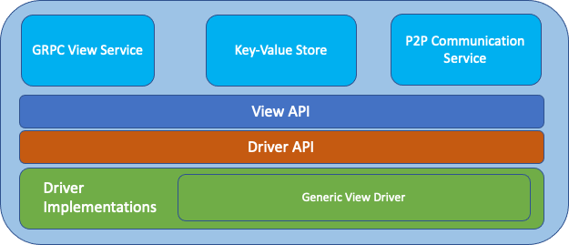

# The View SDK

This is the `View SDK` stack:

It consists of the following layers:
- `Services` (light-blue boxes): Services offer the core building blocks to enable interaction between `FSC nodes` 
and maintain state throughout the execution of a Business Process.
- [`View API`](api.md): This API offers a useful abstraction to implement Business Processes as interactive protocols in an 
implementation and blockchain independent way.
- `Driver API`: This API takes the burden of translating calls of the View API into API calls that are implementation-specific.
- `Driver Implementations`: This is the lowest level of the View SDK. A driver implementation is responsible to define 
and realize the executing and the data of a specified business logic. We provide a `Generic View Driver` that implements 
the primitives used by the `View API`, such as identities, networking, and ledger-specific details.
