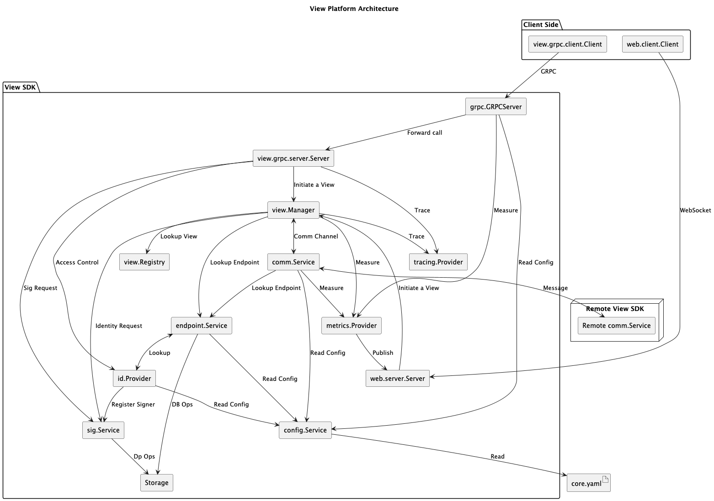

# The View SDK

The View SDK is the base runtime platform of FSC. It provides the public programming contracts used by views and the runtime services that execute them.

At a high level, the View SDK includes:

- the public View programming API in `platform/view/view`;
- the runtime implementation in `platform/view/services/...`;
- the configuration, communication, persistence, and observability services required to run FSC views.

This is the architecture of the View SDK:

## Documentation Map

- [View API](view-api.md) - Public programming surface for `view.View`, `view.Context`, `view.Session`, identities, and nested execution options
- [View Service](services/view-service.md) - Runtime orchestration of contexts, registries, responders, and view execution
- [Configuration Service](services/config-service.md)
- [DB Drivers](services/db-driver.md)
- [Monitoring](services/monitoring.md)

## Components

- [View Service](services/view-service.md) - Core orchestration layer for view lifecycle and protocol coordination
- [Configuration Service](services/config-service.md)
- [DB Drivers](services/db-driver.md)
- [Monitoring](services/monitoring.md)

## Configuration

See [View platform configuration](configuration.md) for the runtime sections that back the View SDK.
