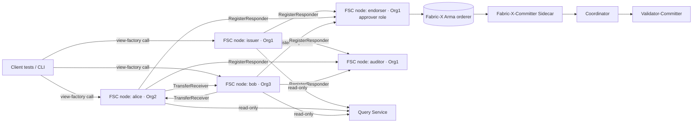

# From Fabric Chaincode to Fabric-X FSC Views — A Tutorial

This example shows how to migrate a Hyperledger Fabric Go chaincode to
Hyperledger Fabric-X using the Fabric-Smart-Client (FSC) view programming
model. The source we migrate is the well-known `asset-transfer-basic`
chaincode from
[hyperledger/fabric-samples](https://github.com/hyperledger/fabric-samples/blob/main/asset-transfer-basic/chaincode-go/chaincode/smartcontract.go).
The target is a real FSC + Fabric-X network started by FSC's NWO
integration test framework — the same harness used by the existing
`integration/fabricx/{simple,iou,multiendorsement,deployment}` examples.

> Tutorial audience: a Hyperledger Fabric chaincode developer who has
> never used FSC. By the end you should know which classical Fabric
> primitives map to which FSC primitives, and you should be able to run
> the example end-to-end on your laptop.

---

## 1. Why this exists

Fabric-X re-architects Hyperledger Fabric for high throughput. Two changes
matter for migration:

1. **Chaincode is gone.** Fabric-X replaces chaincode-as-a-process with
   peer-to-peer transaction-negotiation protocols built on
   [Fabric-Smart-Client](https://github.com/hyperledger-labs/fabric-smart-client).
   Every chaincode function becomes an FSC *view*.
2. **The peer is decomposed.** The Fabric-X-Committer is a set of
   microservices: Sidecar, Coordinator, Verification Service,
   Validator-Committer, and Query Service. Reads route through the Query
   Service; ordering is done by the Arma BFT cluster.

This tutorial answers a single question: *given a working asset-transfer
chaincode, what does the equivalent FSC-on-Fabric-X application look
like?*

---

## 2. The chaincode we are migrating

The Go file we port is 194 lines. It defines an `Asset` struct with five
fields and eight `SmartContract` methods:

```go
type Asset struct {
    AppraisedValue int    `json:"AppraisedValue"`
    Color          string `json:"Color"`
    ID             string `json:"ID"`
    Owner          string `json:"Owner"`
    Size           int    `json:"Size"`
}

// 8 methods:
//   InitLedger, CreateAsset, ReadAsset, UpdateAsset,
//   DeleteAsset, AssetExists, TransferAsset, GetAllAssets
```

The migration's first pleasant surprise is that the on-chain *payload*
shape does not need to change. We keep the exact same struct, with the
exact same JSON tags, in [`states/asset.go`](states/asset.go). Old and
new clients can read each other's data byte-for-byte.

---

## 3. The topology

We use five FSC nodes across three Fabric organisations:



| Node       | Org  | Role                                                           |
| ---------- | ---- | -------------------------------------------------------------- |
| `issuer`   | Org1 | Initiator for `InitLedger` and `CreateAsset`.                  |
| `endorser` | Org1 | Approver. Holds the chaincode-equivalent validation logic.     |
| `auditor`  | Org1 | Witness responder on every state-changing transaction.         |
| `alice`    | Org2 | Asset owner. Initiates Update/Delete/Transfer; receives.       |
| `bob`      | Org3 | Asset owner. Same shape as Alice.                              |

The Fabric-X namespace is named `asset-transfer` and is approved by Org1
with unanimity. The endorser FSC node is therefore the only node whose
signature is *strictly* required by the namespace policy. The auditor and
the receiver still sign — those signatures are enforced at the
initiator's `CollectEndorsementsView` step, not at the namespace policy.

The full topology is in [`topology.go`](topology.go). It mirrors
`integration/fabricx/iou/topology.go` so reviewers familiar with IOU can
read it at a glance.

---

## 4. The migration mapping (cheat sheet)

| Classical chaincode                       | FSC-on-Fabric-X                                              |
| ----------------------------------------- | ------------------------------------------------------------ |
| `ctx.GetStub().PutState(key, val)`        | `tx.AddOutput(stateObject)` — key derived from `GetLinearID` |
| `ctx.GetStub().GetState(key)`             | `qs.GetState(namespace, key)` via the Query Service          |
| `ctx.GetStub().DelState(key)`             | `tx.AddInputByLinearID` with no matching `tx.AddOutput`      |
| `ctx.GetStub().GetStateByRange(s, e)`     | **Not supported.** Three workarounds — see Section 9.        |
| `ctx.GetStub().GetTxID()`                 | `tx.ID()` returned by `state.NewTransaction`                 |
| `ctx.GetStub().SetEvent(name, payload)`   | Finality listener callback or P2P notification view          |
| `ctx.GetStub().GetTransient()`            | View input parameters (passed via FSC P2P, not on-ledger)    |
| Endorsement policy in chaincode lifecycle | Namespace policy + `RegisterResponder` topology              |
| Chaincode binary running on every peer    | Endorser FSC node running an `EndorserView` responder        |

Each row is exercised by code in this directory. The file map:

| File                                     | Lines | Purpose                                                  |
| ---------------------------------------- | ----- | -------------------------------------------------------- |
| [`states/asset.go`](states/asset.go)     |    ~50 | Asset state struct (chaincode-byte-equivalent)          |
| [`views/init.go`](views/init.go)         |   ~120 | InitLedgerView + EndorserInitView                       |
| [`views/create.go`](views/create.go)     |    ~95 | CreateAssetView + factory                               |
| [`views/read.go`](views/read.go)         |    ~70 | ReadAssetView (query-only)                              |
| [`views/update.go`](views/update.go)     |    ~95 | UpdateAssetView + factory                               |
| [`views/delete.go`](views/delete.go)     |    ~80 | DeleteAssetView + factory                               |
| [`views/exists.go`](views/exists.go)     |    ~50 | AssetExistsView (query-only)                            |
| [`views/transfer.go`](views/transfer.go) |   ~140 | TransferAssetView + TransferAssetReceiverView           |
| [`views/get_all.go`](views/get_all.go)   |   ~100 | GetAllAssetsView (explicit-ID-list pattern)             |
| [`views/endorser.go`](views/endorser.go) |   ~140 | EndorserView (the chaincode replacement)                |
| [`views/auditor.go`](views/auditor.go)   |    ~60 | AuditorView (witness responder)                         |
| [`views/utils.go`](views/utils.go)       |    ~50 | FinalityListener helper                                 |
| [`topology.go`](topology.go)             |   ~120 | Topology() — five FSC nodes, three orgs, one namespace  |
| [`sdk.go`](sdk.go)                       |    ~40 | Per-example FSC SDK (mirrors iou/sdk.go)                |
| [`commands_test.go`](commands_test.go)   |   ~150 | Test helpers — one per chaincode method                 |
| [`chaincode_to_fsc_test.go`](chaincode_to_fsc_test.go) | ~120 | Single end-to-end test, reads as a tutorial |

---

## 5. Method-by-method walkthrough

Every paragraph below names the chaincode source method, the FSC view
that replaces it, and the migration's interesting moments.

### 5.1 InitLedger

Chaincode loops over six hard-coded assets and calls `PutState` on each.

```go
for _, asset := range assets {
    json, _ := json.Marshal(asset)
    ctx.GetStub().PutState(asset.ID, json)
}
```

FSC view (`views/init.go`) builds **one** transaction with **six**
`AddOutput` calls and a single `init` command. The endorser checks that
the count is six and that no asset already exists.

```go
tx, _ := state.NewTransaction(viewCtx)
tx.SetNamespace(Namespace)
tx.AddCommand("init")
for _, asset := range SeedAssets() {
    tx.AddOutput(asset)
}
viewCtx.RunView(state.NewCollectEndorsementsView(tx, i.Endorser, i.Auditor))
viewCtx.RunView(state.NewOrderingAndFinalityWithTimeoutView(tx, FinalityTimeout))
```

### 5.2 CreateAsset

Chaincode does its own existence check then `PutState`. The FSC view
builds a one-output transaction; the existence check is performed by the
endorser via `qs.GetState(Namespace, out.ID)` against the Query Service.

### 5.3 ReadAsset

Chaincode: `GetState`. FSC: `queryservice.GetQueryService` →
`qs.GetState`. **No transaction, no endorsement, no orderer.** This is
the cleanest migration shape — query-only methods do not become full
view dances.

### 5.4 UpdateAsset

Chaincode existence-checks then overwrites. FSC uses
`tx.AddInputByLinearID(id, in)` to **load** the existing asset (which
also serves as the existence check) and `tx.AddOutput(out)` for the new
value. The endorser confirms `in.ID == out.ID`.

### 5.5 DeleteAsset

Chaincode: `DelState`. FSC: load the asset as an input, do **not**
produce an output for the same key. The state package interprets the
"input without matching output" pattern as a deletion.

### 5.6 AssetExists

Chaincode `GetState` + nil check. FSC: `qs.GetState` + nil check. Same
mapping as ReadAsset; no transaction.

### 5.7 TransferAsset — the most interesting view

Chaincode mutates `asset.Owner` and PutState's. The new owner has no say
in whether they receive the asset.

FSC's [`TransferAssetView`](views/transfer.go) collects endorsements in
this order: **new owner first**, **endorser**, **auditor**. The new
owner runs [`TransferAssetReceiverView`](views/transfer.go) and signs
**only if it accepts** the incoming asset. This is a strictly stronger
property than the chaincode could express:

> A buggy or malicious caller can no longer force an asset onto an
> unwilling new owner. Receiver acceptance is part of the protocol.

The endorser additionally requires that `Color`, `Size`, and
`AppraisedValue` do **not** change on a transfer — another tightening
the chaincode did not enforce.

### 5.8 GetAllAssets — the migration's sharp edge

Chaincode walks every key with `GetStateByRange("", "")`. The Fabric-X
Query Service **does not support range scans** — see
`platform/fabricx/core/vault/vault.go`:

```go
// GetStateRange returns an error as range queries are not supported by the QueryService.
return nil, errors.New("GetStateRange not supported by VaultX QueryService")
```

This file's `GetAllAssetsView` uses the **explicit-ID-list** pattern:
the caller passes the IDs to resolve, and we batch-fetch via
`qs.GetStates`. The view godoc lists three migration patterns; the
tutorial's Section 9 walks through all three.

---

## 6. Running the example

Prerequisites — match the Fabric-X compatibility matrix at the time of
writing:

| Tool                | Version          |
| ------------------- | ---------------- |
| Go                  | 1.26+            |
| Docker              | 20.x+            |
| Fabric-X-Orderer    | v0.0.21 / v0.0.23 |
| Fabric-X-Committer  | v0.1.7  / v0.1.9 |

Run the test from the FSC repo root:

```bash
cd integration/fabricx/chaincode-to-fsc
go test -v -ginkgo.v
```

Expected output (abridged):

```
Bootstrapping the endorser to process the asset-transfer namespace
InitLedger — chaincode wrote 6 assets via PutState; FSC writes 6 outputs in one tx
ReadAsset — chaincode used GetState; FSC uses Query Service
AssetExists — chaincode read+nil-check; FSC same shape, no unmarshal
CreateAsset — happy path: brand-new ID
CreateAsset — negative path: duplicate ID is rejected by the endorser
UpdateAsset — chaincode existence-check + PutState; FSC uses AddInputByLinearID
TransferAsset — chaincode mutated Owner unilaterally; FSC requires receiver acceptance
TransferAsset — negative path: no-op transfer rejected at the initiator
DeleteAsset — chaincode existence-check + DelState; FSC: AddInputByLinearID, no output
GetAllAssets — chaincode used GetStateByRange; Fabric-X has no range query, FSC uses explicit-ID-list
```

If you only want to run the test in dry-run mode (topology generation,
no Fabric-X bring-up), pass `-ginkgo.dryRun`.

---

## 7. What the test exercises

[`chaincode_to_fsc_test.go`](chaincode_to_fsc_test.go) has a single
spec with `By(...)` blocks naming each chaincode method and the
behavioural assertion. Highlights:

- **Happy path for all eight methods** in order: bootstrap → init →
  read → exists → create → update → transfer → delete → getAll.
- **Duplicate-ID create** is rejected by the endorser.
- **No-op transfer** (transfer to current owner) is rejected at the
  initiator before reaching the endorser, demonstrating early-failure
  semantics.
- **Transfer integrity** — after `alice → bob`, the asset's `Color`,
  `Size`, and `AppraisedValue` are unchanged, proving the endorser's
  pure-transfer invariant.
- **Read-after-delete** returns the chaincode-equivalent error string
  (`"the asset %s does not exist"`).

---

## 8. Architectural choices we made and why

### 8.1 Why a separate auditor node

Classical chaincode applications often retrofitted an auditor by
emitting chaincode events and scraping them off-chain. With FSC the
auditor becomes a topology-level role — register an FSC node, hand it
`AuditorView` as a responder, and every state-changing transaction
automatically pulls the auditor into the endorsement flow. We did this
to demonstrate the pattern; the example would still work without it.

### 8.2 Why receiver-as-responder for Transfer

The chaincode TransferAsset is one-sided. The FSC version is two-sided.
This is not a faithful migration in the strict sense — it changes the
protocol's security model — but it is *the* migration's most useful
upgrade for any application where asset receipts have side effects.

### 8.3 Why the asset's JSON shape is preserved verbatim

Apps that store hashes of on-chain payloads, or apps with off-chain
indexers that watch for chaincode-era state transitions, do not need to
re-tool. The `states.Asset` struct is byte-equivalent to the chaincode
struct.

---

## 9. Migration sharp edges

### 9.1 Range queries

`GetStateByRange` is not supported. Three workarounds, in increasing
order of complexity:

1. **Explicit-ID-list (this PoC).** Caller passes the IDs. Trivial; no
   on-chain bookkeeping; suits registry-style apps where the caller
   already knows which IDs exist.
2. **Index key.** A dedicated key holds the JSON-encoded list of live
   asset IDs. Every Create / Delete also updates the index. The
   endorser must verify the index is internally consistent. Cost: one
   extra output per state-changing transaction, plus a small expansion
   of endorser logic.
3. **Off-chain index.** An FSC node subscribes to namespace commit
   events via finality listeners and maintains a local view. The view
   reads the local index. Best for analytics-style queries; weakest
   consistency on cold start.

### 9.2 Chaincode events

`SetEvent` has no direct FSC analogue. Three options:

1. Use the finality listener (`OnStatus`) callback on the initiator —
   suitable for the initiator's own bookkeeping.
2. Add a P2P notification view that the initiator runs against
   subscribers after finality — suitable for cross-node fan-out.
3. Persist a "log" namespace in addition to the data namespace — events
   become rows in a separate Fabric-X namespace.

### 9.3 Transient data

Chaincode transient maps were the only way to pass private data to the
chaincode without putting it in the read-set. With FSC, view input
parameters are *already* off-ledger — they travel via FSC P2P, not
through the orderer. Anything that was transient becomes an ordinary
view parameter.

### 9.4 Private data collections

PDCs do not exist in Fabric-X. Three migration patterns:

1. **Separate namespace per privacy boundary.** Tightest isolation;
   most policy-management overhead.
2. **Hash-on-ledger, body-via-P2P.** Initiator sends the body to
   selected responders; the on-ledger output is just the hash.
   Closest to the original PDC mental model.
3. **Encrypted state.** Encrypt with a key shared via Fabric-CA among
   the privacy-set members. Heaviest crypto budget; works without any
   topology change.

This PoC does not exercise any of (1)–(3) because asset-transfer-basic
has no private data. The follow-on demo (asset-transfer-private-data)
will demonstrate option 2.

---

## 10. Where to next

- **Second demo (work-in-progress).** A port of
  `asset-transfer-private-data` that exercises the
  hash-on-ledger / body-via-P2P pattern from §9.4.
- **CC-Tools port (stretch).** Show that the methodology generalises
  beyond hand-written chaincode.
- **Index-key range scan helper (stretch).** A reusable FSC view that
  implements the index-key pattern from §9.1, so applications get a
  drop-in substitute for `GetStateByRange`.
- **Blog post.** A 1500–2500-word digest of this README aimed at the
  LFDT community.
- **Meetup talk.** A 15-minute walkthrough with slides.

Issues and PRs welcome. The mentorship project that produced this
example is tracked in
[LF-Decentralized-Trust-Mentorships/mentorship-program#59](https://github.com/LF-Decentralized-Trust-Mentorships/mentorship-program/issues/59).
